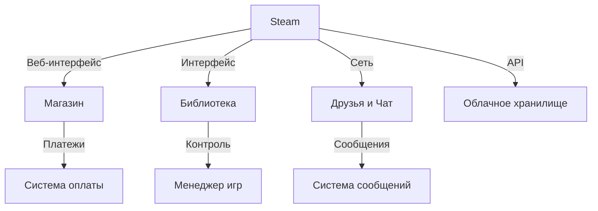
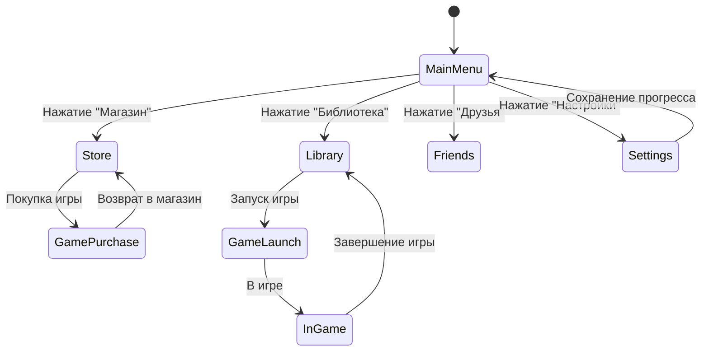
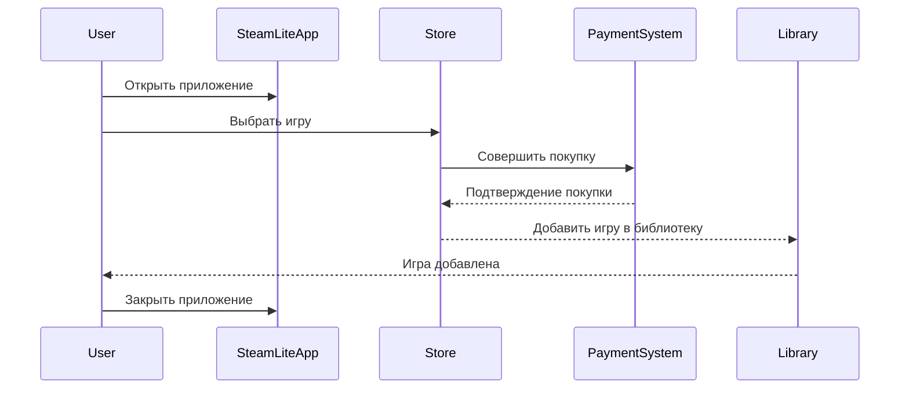

# Steam
**Steam** — это  платформа для дистрибуции видеоигр, предназначенная для покупки, скачивания и управления игровыми коллекциями. Платформа предлагает удобные инструменты для игроков и разработчиков, а также включает социальные функции, такие как чаты, достижения и игровая статистика.

### Описание системы
Steam служит как единая платформа для всех игр пользователя, включая возможности онлайн-магазина и библиотеки игр, предлагая инструменты для запуска игр и взаимодействия с сообществом.

#### Основные компоненты системы:
- **Онлайн-магазин** — позволяет искать, приобретать и загружать игры.
- **Библиотека игр** — упрощённое управление коллекцией игр, установка и обновление.
- **Социальные функции** — чаты, система достижений и кроссплатформенный мультиплеер.

### Возможности
#### Магазин:
- Поиск и фильтрация игр по жанрам, дате выхода, цене.
- Автоматические скидки и распродажи.
- Оплата через банковские карты и электронные кошельки.

#### Библиотека:
- Упрощённое управление загруженными играми.
- Ручная установка обновлений и управление дополнениями (DLC).
- Встроенные советы и рекомендации на основе предпочтений игрока.

#### Социальные возможности:
- Чат в реальном времени с друзьями.
- Система достижений и глобальные рейтинги.
- Совместная игра с друзьями через приглашения.

### Преимущества
- Легковесная версия основной платформы, минимальный объём для скачивания.
- Интуитивно понятный интерфейс, подходящий как для начинающих, так и для опытных игроков.
- Поддержка модификаций и пользовательского контента.

## UML Диаграммы

### Диаграмма компонентов (Component Diagram)

#### Steam включает компоненты магазина, библиотеки игр, общения с друзьями и облачного хранилища.
#### Store взаимодействует с платёжной системой для обработки транзакций.
#### Library управляется через менеджер игр для установки и обновления игр.
#### Friends используют систему сообщений для чатов и приглашений.

### Диаграмма состояний (State Diagram)

#### Диаграмма показывает возможные состояния пользователя: от главного меню до покупки игры или запуска игры, а также переход в раздел с друзьями и настройками.

### Диаграмма взаимодействий (Collaboration Diagram)

#### Диаграмма взаимодействий показывает процесс покупки игры, начиная с выбора в магазине, завершением оплаты и добавлением в библиотеку пользователя.

___________________________________________________________________________________________
